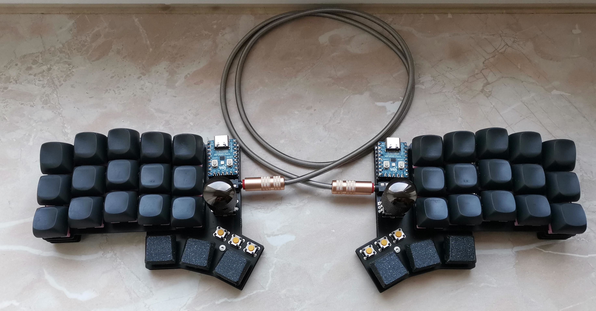

# narfkb

[More pictures here](https://imgur.com/a/LNFxImS)

## Attention

I'm a hobbyist/amateur at best. So there may be things that aren't optimized. For example the routing on the PCB is a hot mess
and the spacers between the plate should be 3.4mm but there aren't any spacers that size. That being said I've had the files
in the `gerbers/` directory manufactured at JLC with 1.6mm size and they work just fine with the code provided in the `qmk/`
directory. So if you decide to use this, then please be advised that I'm not providing any sort of liability and you should
exercise some caution.

## BOM

| Quantity  | Item                               | Comment                  |
| --------- | ---------------------------------- | ------------------------ |
| 2         | Waveshare RP2040-Zero              |                          |
| 2         | IC-Sockets for MCU                 | Optional but recommended |
| 2         | TRRS Sockets                       |                          |
| 44        | 1N4148 SOD123 diodes               |                          |
| 30        | MX Hotswap Sockets                 |                          |
| 6         | Choc Hotswap Sockets               |                          |
| 2         | EC11 Encoders                      |                          |
| 6         | Omrom 6mm Tact switches            | B3F-1002                 |
| 30        | MX Switches + Keycaps              |                          |
| 6         | Choc Switches + Keycaps            |                          |
| 12        | M2 Screws, Nuts, Bolts and Spacers |                          |

## Feedback

I'm always happy to hear your opinions about this and if you decide to build this board then please do send me a picture of it.
